# Homework 3
## 题目一
需要使用PostgreSQL及DataGrip软件操作，并对操作页面及结果进行截图。

1.新建一个university数据库，并执行largeRelationsInsertFile.sql，导入数据。
### 解答：
* 新建university数据库

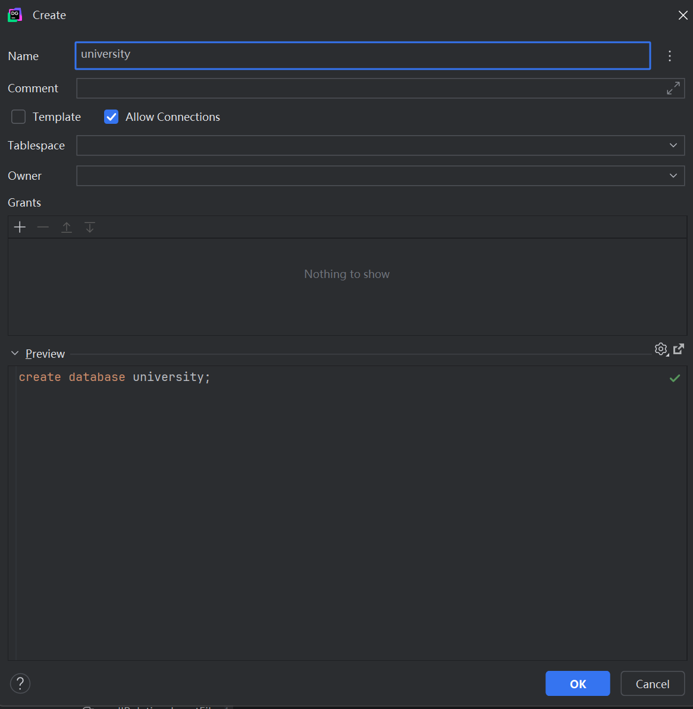
* 连接university数据库

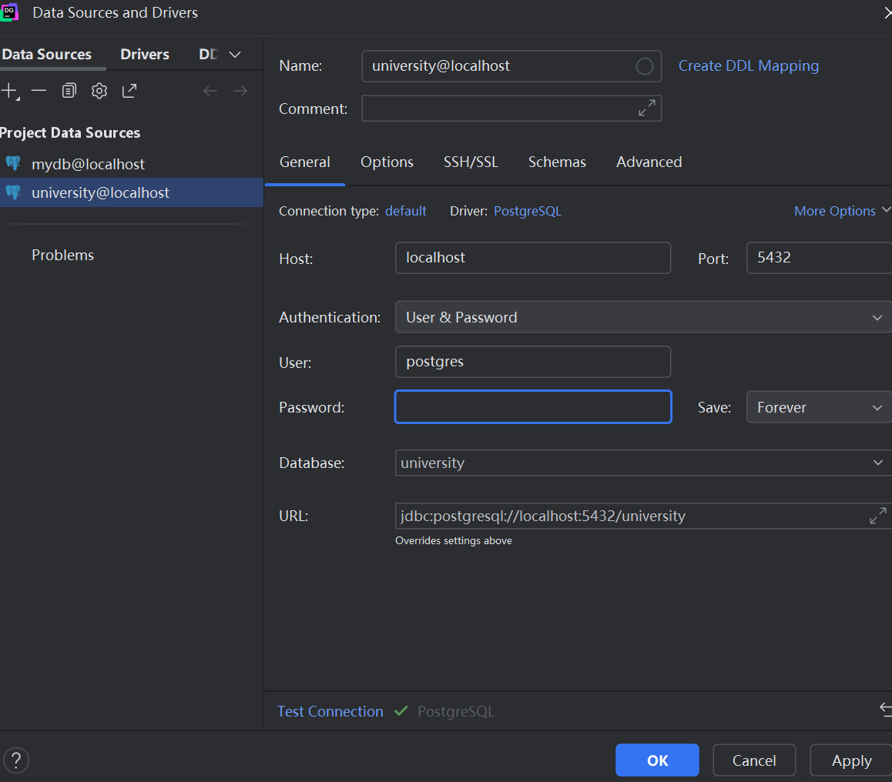
* 导入largeRelationInsertFile.sql

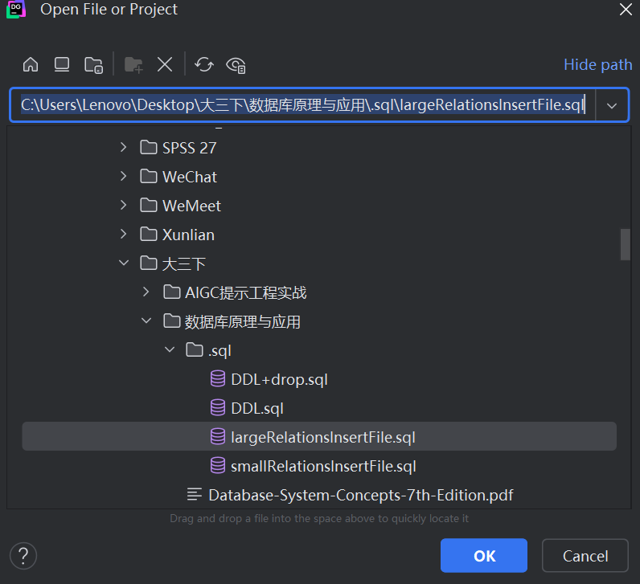
* 运行largeRelationInsertFile.sql

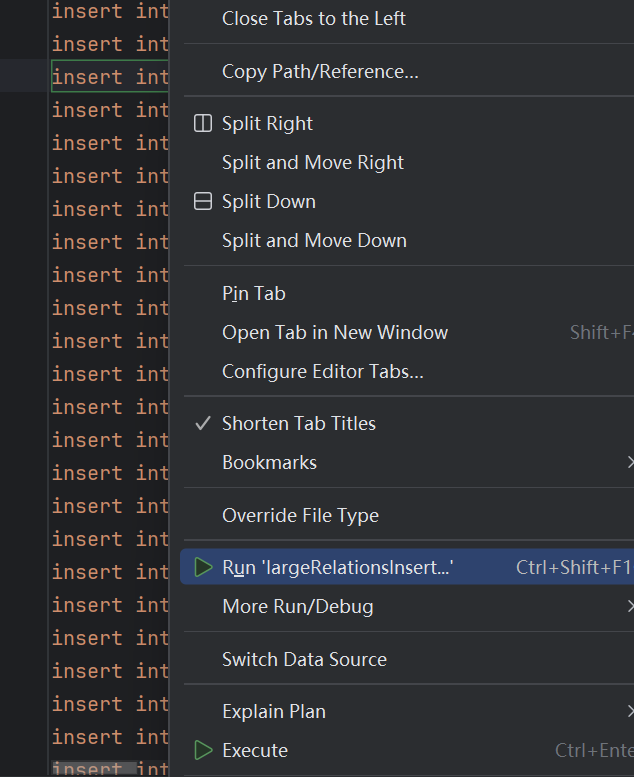
* 配置数据源

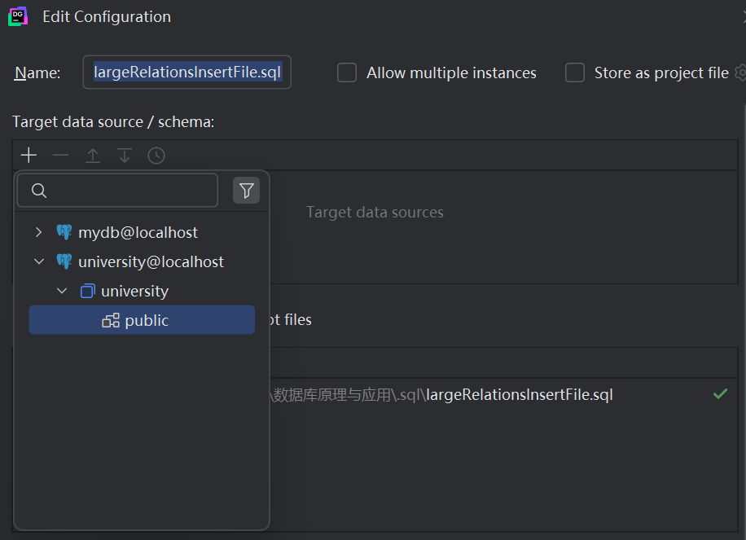
* 结果

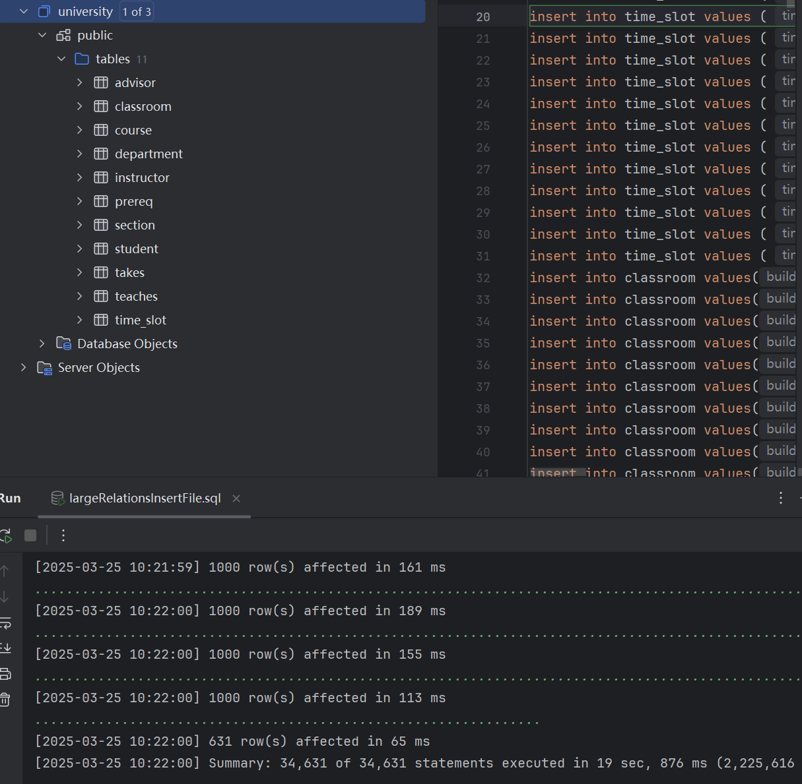 

2.运行第2次作业的题目三代码。注意：把原题目中的会计改成History。
### 解答：
* 新建Query Console后运行代码

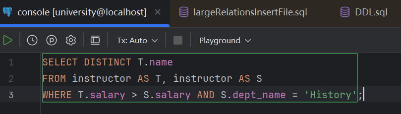
* 查询结果

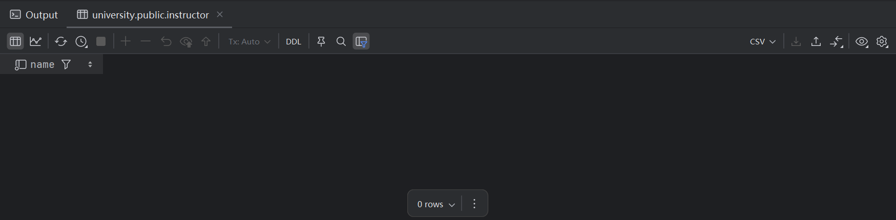
## 题目二
参考Pattern Matching，在PG中使用至少三种方法实现找到所有以S开头教师的名字。
### 解答：
```sql
-- 方法1：使用LIKE
SELECT DISTINCT name
FROM instructor
WHERE name LIKE 'S%';
-- 方法2：使用SIMILAR TO
SELECT DISTINCT name
FROM instructor
WHERE name SIMILAR TO 'S%';
-- 方法3：使用POSIX 正则表达式 ~
-- ~表示正则匹配（区分大小写）；^S表示匹配以 S 开头的字符串
SELECT DISTINCT name
FROM instructor
WHERE name ~ '^S';
-- 方法4：使用LEFT()函数
-- LEFT(name, 1) 提取 name 列的第一个字符
SELECT DISTINCT name
FROM instructor
WHERE LEFT(name, 1) = 'S';
-- 方法5：使用POSITION()函数
-- POSITION('S' IN name) 返回 'S' 在 name 中出现的位置
SELECT DISTINCT name
FROM instructor
WHERE POSITION('S' IN name) = 1;
-- 方法6：使用 SUBSTRING() 函数
-- SUBSTRING(name FROM 1 FOR 1) 取 name 的第一个字符
SELECT DISTINCT name
FROM instructor
WHERE SUBSTRING(name FROM 1 FOR 1) = 'S';
```
### 查询结果：
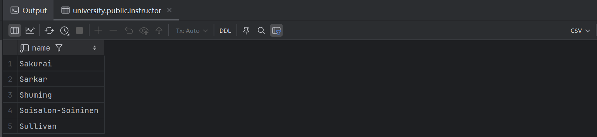
## 题目三
psql是PostgreSQL的命令行工具。请使用psql命令行工具：
- 实现题目二

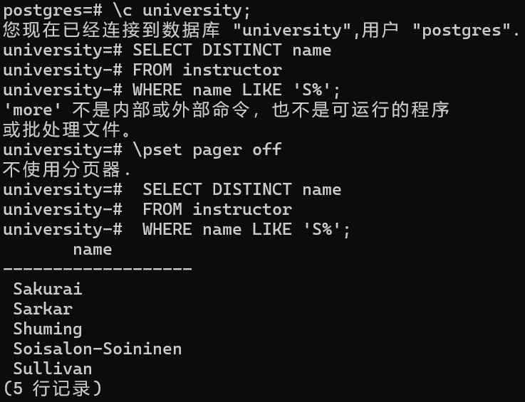

首先切换到university数据库。以上显示了在psql命令行工具中操作方法1的结果，方法2-方法6同理，不再展示。
- 列出所有的数据库

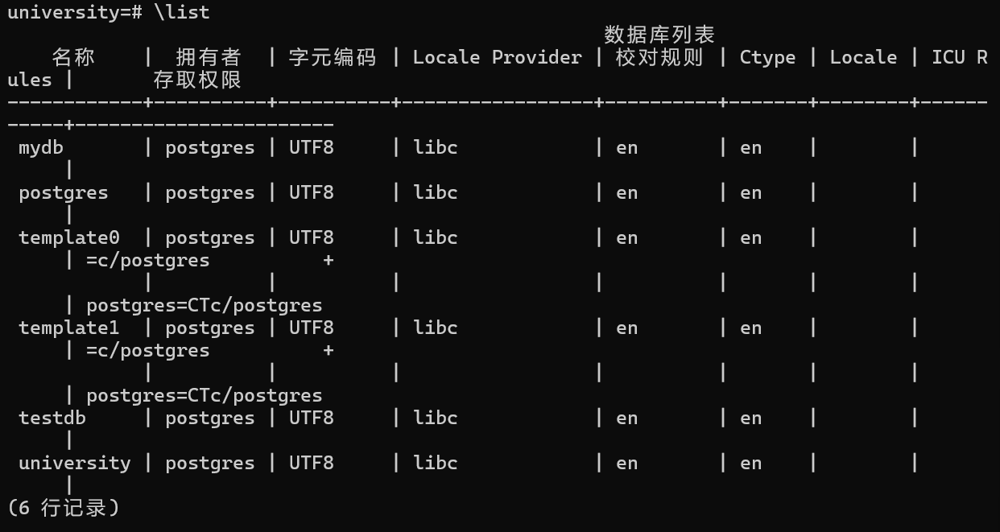
- 列出当前数据库的所有表

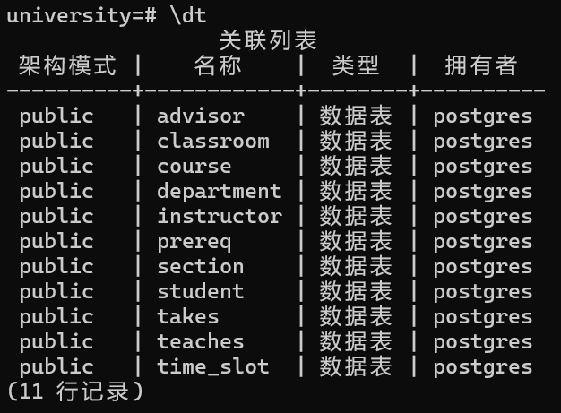
- 显示某张表的关系模式

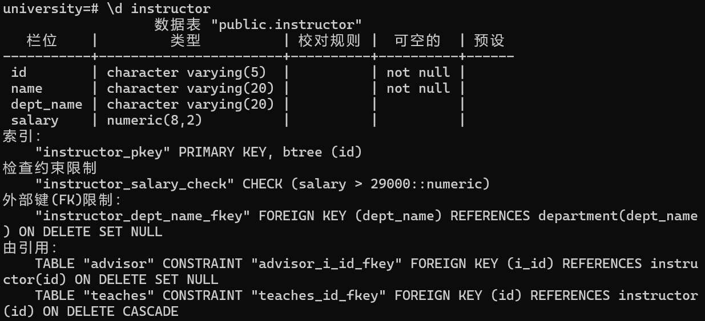

以instructor表为例，上图显示了instructor表的关系模式
