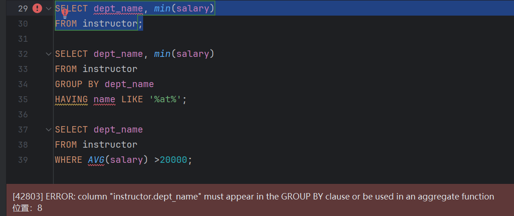
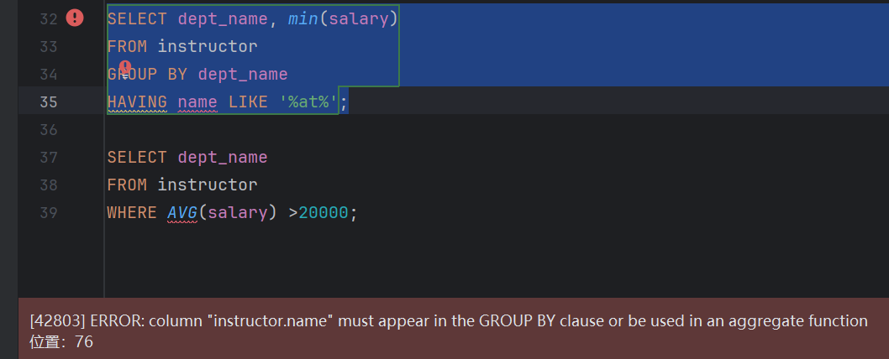
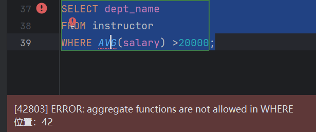

# Homework 4
## 题目一
请问下面的SQL语句是否合法？用实验验证你的想法。你从实验结果能得到什么结论？
```sql
SELECT dept_name, min(salary)
FROM instructor;

SELECT dept_name, min(salary)
FROM instructor
GROUP BY dept_name
HAVING name LIKE '%at%';

SELECT dept_name
FROM instructor
WHERE AVG(salary) > 20000;
```
### 解答：

```txt
不合法。使用聚合函数（min）时，非聚合列（dept_name）必须出现在GROUP BY子句中。
因为聚合函数会对整个表返回单一值，而非聚合列需要明确制定分组依据。
```

```txt
不合法。HAVING 子句引用了未分组的列 name，语法上不正确。
通常，HAVING 中引用的列要么是聚合结果，要么是 GROUP BY 中的列。
```

```txt
不合法。WHERE 子句不能直接使用聚合函数（AVG）。
聚合函数需要在 GROUP BY 和 HAVING 的上下文中使用。
```
合法版本：
```sql
SELECT dept_name, min(salary)
FROM instructor
GROUP BY dept_name;

SELECT dept_name, min(salary)
FROM instructor
WHERE name LIKE '%at%'
GROUP BY dept_name;

SELECT dept_name
FROM instructor
GROUP BY dept_name
HAVING AVG(salary) > 20000;
```
## 题目二
1.找到工资最高员工的名字，假设工资最高的员工只有一位（至少两种写法）。
### 解答：
```txt
内容
```
2.找到工资最高员工的名字，假设工资最高的员工有多位（试试多种写法）。
### 解答：
```sql
内容
```
3.解释下面四句。
```sql
SELECT 1 IN (1);

SELECT 1 = (1);

SELECT (1, 2) = (1, 2);

SELECT (1) IN (1, 2);
```
### 解答：
