# Homework 5
考虑关系模式`product(product_no, name, price)`，完成下面的题目：
## 题目一
在数据库中创建该关系，并自建上面关系的txt数据文件：
1. 使用`COPY`命令导入数据库（PostgreSQL）。
### 解答：
首先，在本地新建一个products.csv文件，文件中输入以下信息：
```txt
product_no,name,price
1,Laptop,999.99
2,Phone,499.99
3,Tablet,299.99
```
确保文件存储在可访问的路径，且PostgreSQL服务器对该路径有读取权限。连接到PostgreSQL数据库，在控制台输入以下命令：

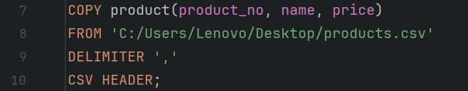

可以看到，csv文件已经导入到了数据库

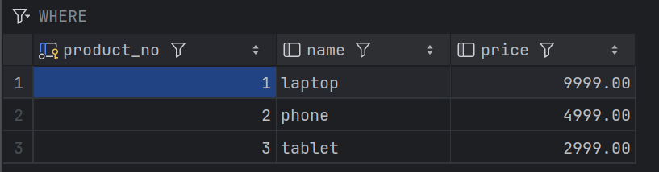

2. 将该关系导出为任意文件（如SQL、Txt、CSV、JSON等）。
### 解答：
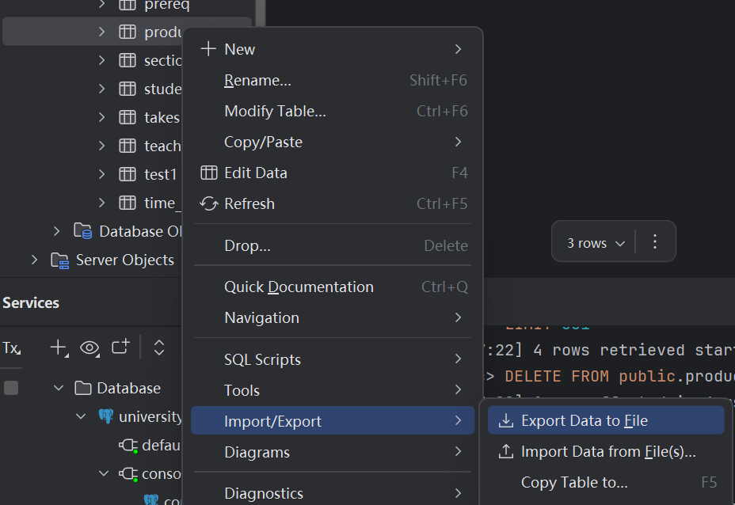
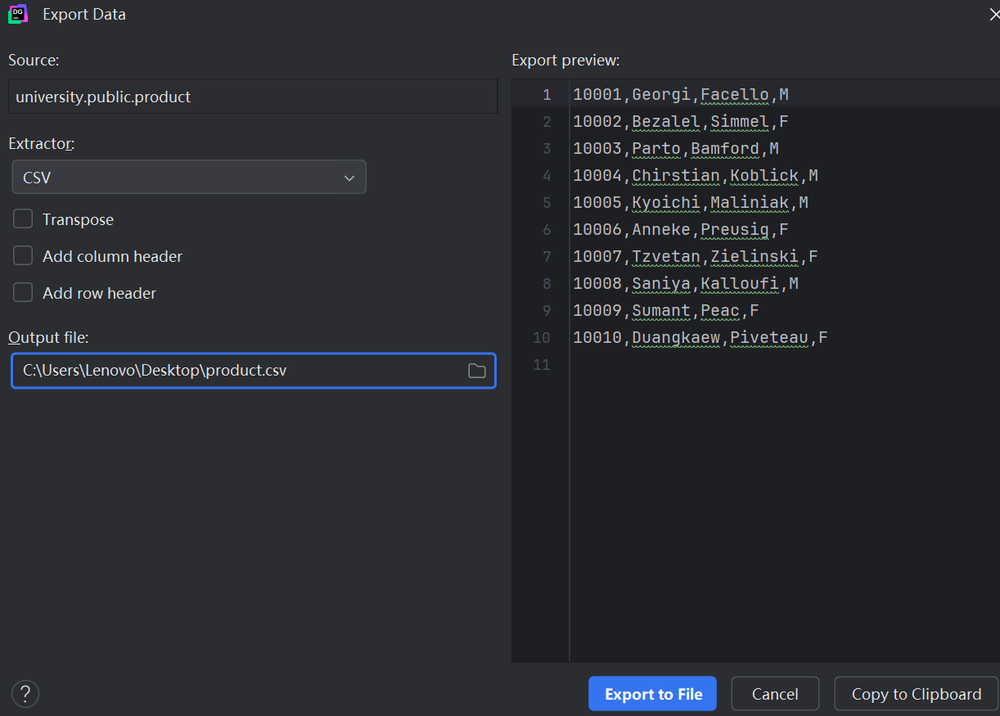
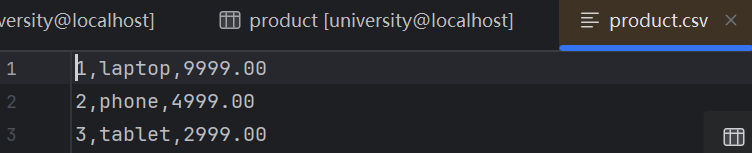
## 题目二
1. 添加一个新的商品，编号为`666`，名字为`cake`，价格不详。
```sql
INSERT INTO product(product_no, name, price)
VALUES('666', 'cake', NULL);
```
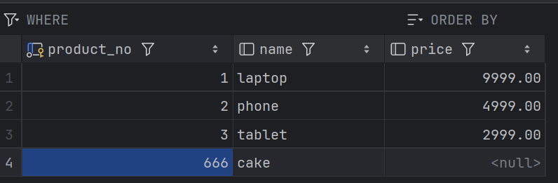

2. 使用一条SQL语句同时添加3个商品，内容自拟。
```sql
INSERT INTO product(product_no, name, price)
VALUES
	('111', 'meat', 67.2),
	('222', 'eggs', 12.1),
	('333', 'milk', 24.7);
```
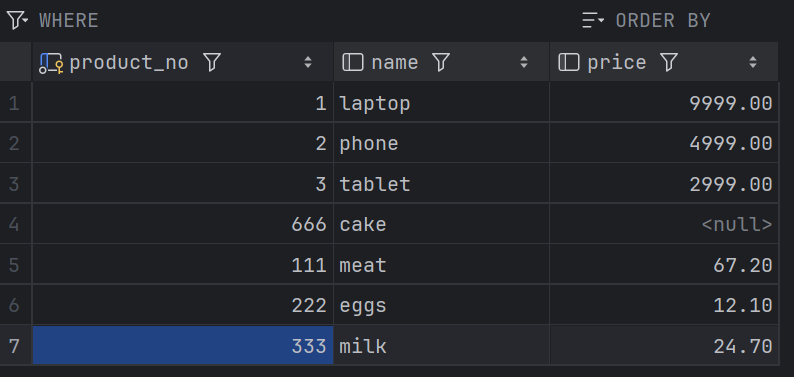

3. 将商品价格统一打8折。
```sql
UPDATE product
SET price = price * 0.8
WHERE price IS NOT NULL;
```
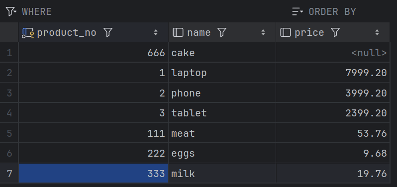   

4. 将价格大于100的商品上涨2%，其余上涨4%。
```sql
UPDATE product
SET price = CASE
	WHEN price >100 THEN price * 1.02
	ELSE price * 1.04
	END;
WHERE price IS NOT NULL;
```
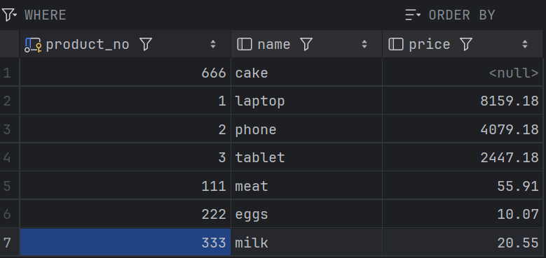  

5. 将名字包含`cake`的商品删除。
```sql
DELETE FROM product
WHERE name LIKE '%cake%';
```
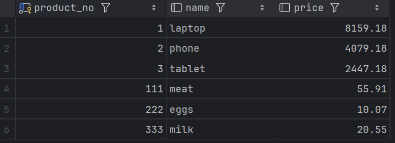  

6. 将价格高于平均价格的商品删除。
```sql
DELETE FROM product
WHERE price > (SELECT AVG(price) FROM product)
AND price IS NOT NULL;
```
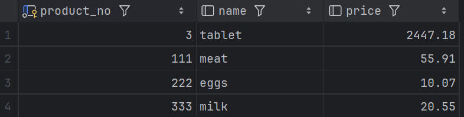 
## 题目三
### 针对PostgreSQL
使用参考下面的语句添加10万条商品，
```sql
-- PostgreSQL Only
INSERT INTO product (name, price)
SELECT
    'Product' || generate_series, -- 生成名称 Product1, Product2, ...
    ROUND((random() * 1000)::numeric, 2) -- 生成0到1000之间的随机价格，保留2位小数
FROM generate_series(1, 100000);
```
比较`DELETE`和`TRUNCATE`的性能差异。
### 解答：
运行后，遇到报错：
```txt
[23502] ERROR: null value in column "product_no" of relation "product" violates not-null constraint 详细：Failing row contains (null, Product1, 756.70).
```
报错原因：product_no作为主码，不能为NULL。修改为如下语句：
```sql
INSERT INTO product (product_no, name, price)
SELECT
    generate_series,
    'Product' || generate_series,
    ROUND((random() * 1000)::numeric, 2)
FROM generate_series(1, 100000);
```
将之前的表格清空后运行此语句，得到序号为1-100000的商品
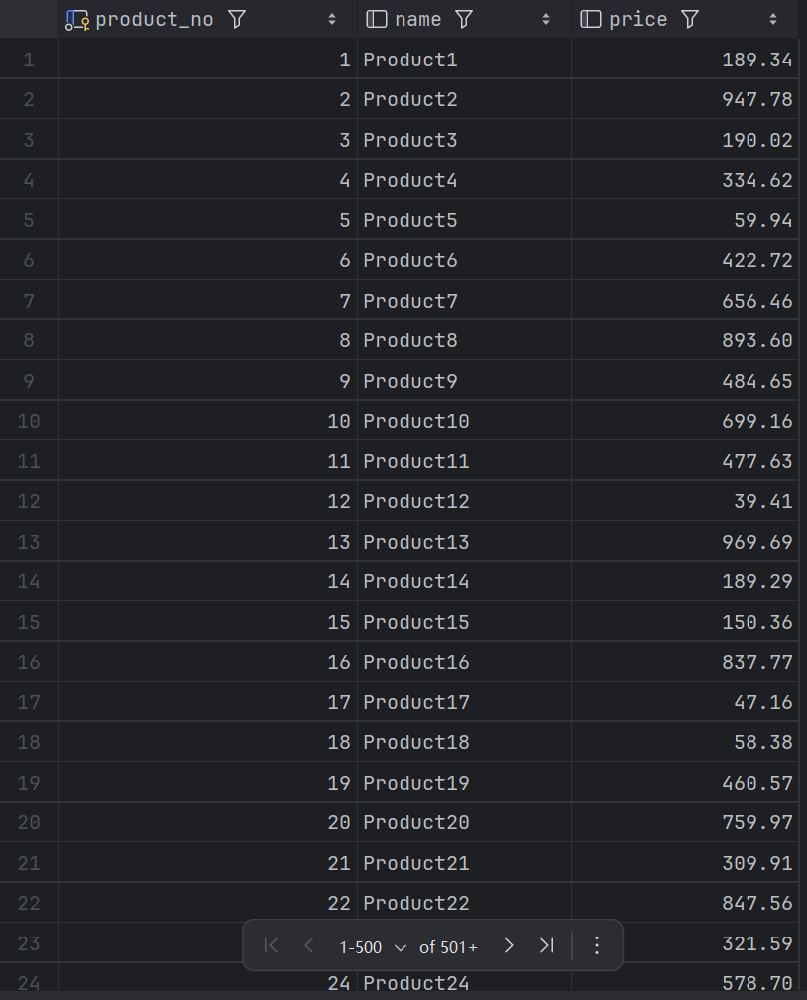 
* 比较性能差异
```sql
\timing ON
DELETE FROM product;
```
得到DELETE的执行时间为：

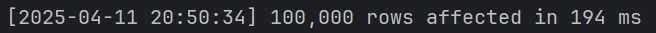 

```sql
\timing ON
TRUNCATE TABLE product;
```

得到TRUNCATE的执行时间为：

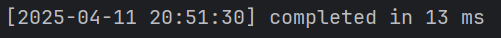 

1.执行时间：TRUNCATE 速度远超 DELETE，因其重置表存储而无需逐行处理。

除了执行时间，还有以下性能差异：

2.事务日志：TRUNCATE 产生最少的事务预写日志（WAL）条目，而 DELETE 为每行记录日志，增加磁盘 I/O 开销。

3.空间回收：TRUNCATE 立即回收表空间（执行后约 8 KB）；DELETE 产生死元组（dead tuple），需运行 VACUUM 释放空间（未清理前约 8–10 MB）。

4.约束与触发器：DELETE 遵守外键约束并触发相关触发器，确保参照完整性；TRUNCATE 忽略触发器，若表有外键约束可能失败，除非使用 CASCADE。

5.序列处理：TRUNCATE 默认重置 SERIAL 序列，除非指定 CONTINUE IDENTITY；DELETE 保持序列不变。

建议：对于无外键约束的独立表，需快速清空所有行时，推荐使用 TRUNCATE。若需部分删除、强制约束或执行触发器，则使用 DELETE。


