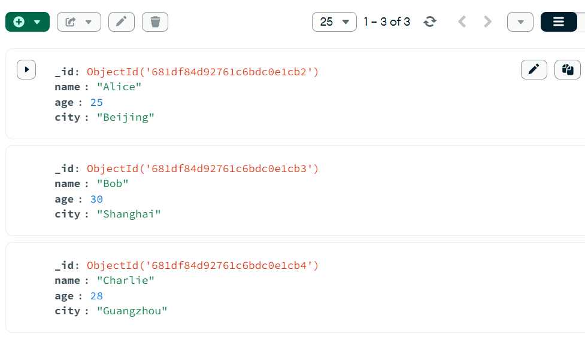
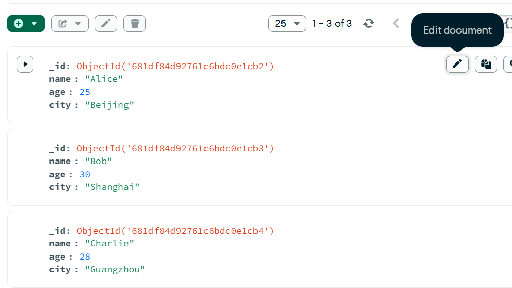

# Homework 7
安装一个非关系型数据库（不限制），并完成简单的增、删、改、查。需要截图操作。

常见的非关系型数据库（NoSQL）有文档存储、键值存储和宽列存储等类型。选择文档存储类数据库MongoDB，下载：https://www.mongodb.com/try/download/community

MongoDB官方文档：https://docs.mongodb.com/

安装好并启动MongoDB后，执行基本的增、删、改、查操作。

可使用图形化工具MongoDBCompass (https://www.mongodb.com/try/download/compass)

打开后界面如下：

连接默认本地MongoDB。连接字符串：mongodb://localhost:27017后点击Connect

连接成功后，左侧显示数据库列表

创建数据库和集合：点击Create Database
输入数据库名(mydb)和集合名(users)

选择mydb > users进入集合

* 增
在users集合界面，点击Add Data > Insert Document

输入JSON格式数据，点击Insert

Insert结果

* 查
默认显示集合中所有数据。
通过在Filter输入框输入查询条件进行过滤查询，点击Find查看结果。

e.g 查找name为Alice的记录

e.g 查找age大于27的记录

* 改
找到要修改的文档，点击右上角Edit document图标。

修改字段值，点击UPDATE保存

Update结果

* 删
找到要删除的文档，点击右侧Delete图标，确认删除

Delete结果

也可在MongoDB Shell中执行以下命令进行增、删、改、查操作。比起Compass图形化界面，Shell中可以进行批量更新或删除操作

* 增
创建数据库后，使用insertOne插入1条数据，使用insertMany插入多条数据。
每次操作后使用find().pretty()查询所有数据进行验证。

* 查
使用findOne查询单条匹配数据，使用find查询所有符合条件的数据

* 改
给出匹配条件后，$set进行更新字段。可使用updateOne，也可使用updateMany进行批量更新

* 删
同理，删除操作有deleteOne和deleteMany两种。操作完毕后，使用exit推出shell

